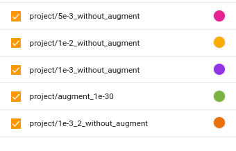
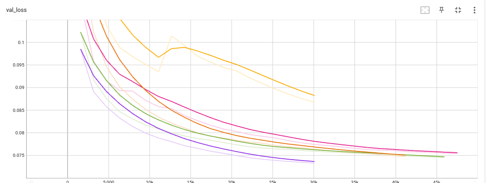
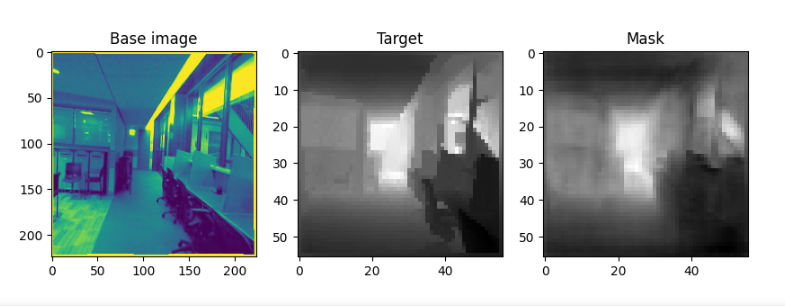
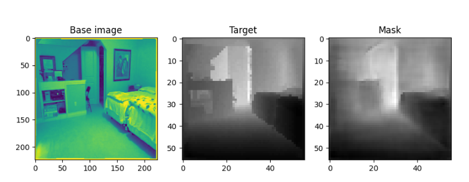
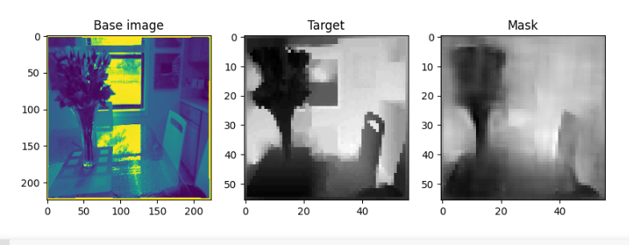
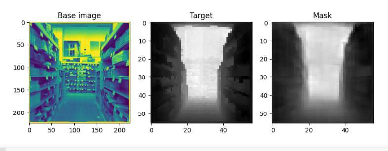
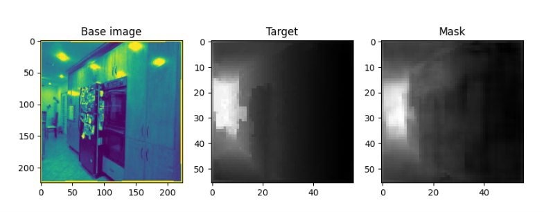
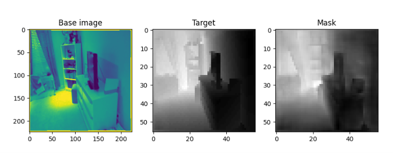
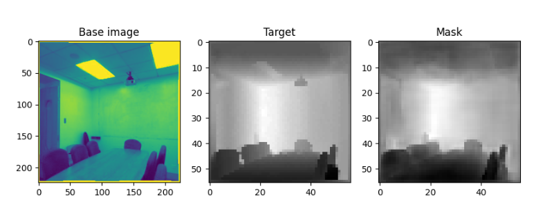

# Project Results

## Experiments

Project was suppose to fulfill these [requirements](project_requirements.md)

I described here 5 models train in different configurations:
1. Learning Rate - 5e-3, without augmentation
2. Learning Rate - 1e-2, without augmentation
3. Learning Rate - 1e-3, without augmentation
4. Learning Rate - 1e-3, with augmentation (Gaussian Blur)
5. Learning Rate - 1e-3, without augmentation (second attempt):

Legend:

Trained Model Loss Value:

One Epoch was trained on sth around 50670 images (1584 steps with batch size = 32).
Model contains 628 000 trained parameters.
Training was done using Google Colab but in most cases training was stopped because i was tun out of free Google GPU
so tests so training could not be done to the end.

## Results:
1. 5e-3:

    
    
2. 1e-2:

    
    
3. 1e-3:

    
4. 1e-3 with augmentation:

    
    

## Conclusions

Every model gave quite good results and only by comparing output it is hard to indicate the best model. 
Also every could still be trained if i would have necessary suitable environment for that kind experiment.
Interesting that model with the biggest LR could escape from Local Minimum Trap.
After comparison to models with the same parameters (1e-3, without augment) we can see how important it is to start from good seed (that's the only difference in these 2 models)

